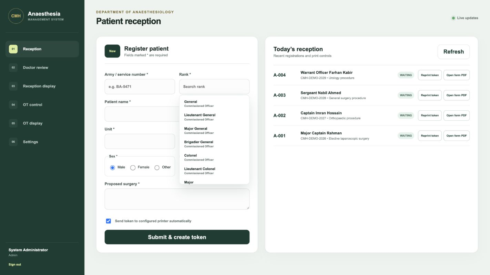
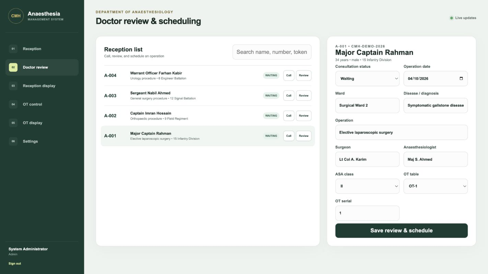
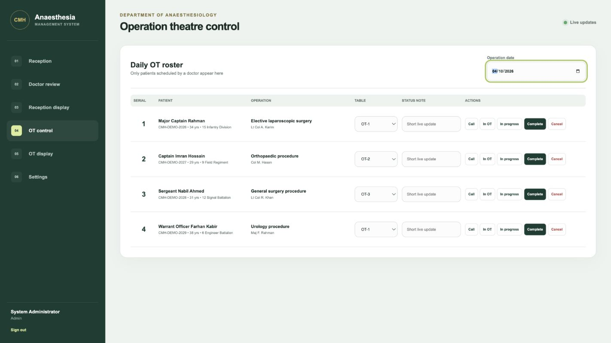
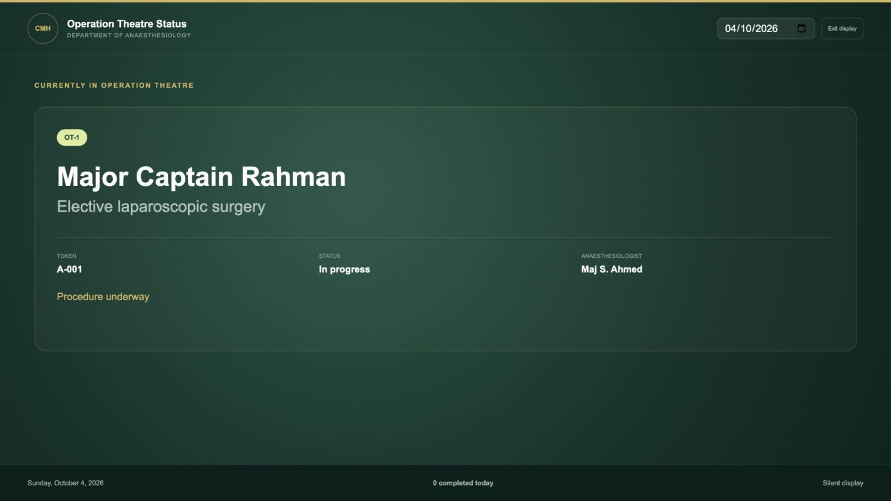
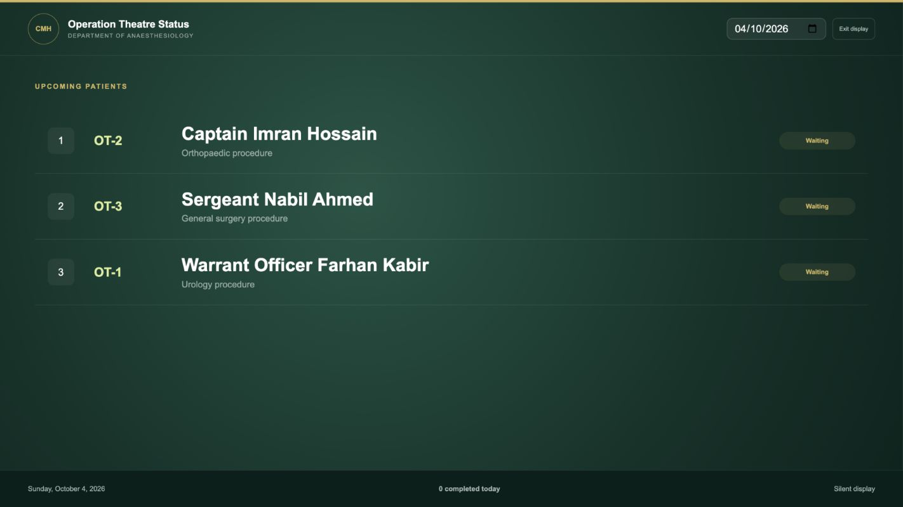

# CMH Anaesthesia Management System Project Experience and Pilot Readiness Report

**Prepared for:** Project Manager and IT Head, Department of Anaesthesiology, CMH Dhaka
**Prepared by:** CMH Anaesthesia project team
**Report date:** 3 October 2026
**Release covered:** Version 1.0.0 pilot candidate

This report records the project from the first workflow discussion through the working demonstration, presentation revisions, and database and release hardening. It explains what the system does, what changed after review, how the software will be controlled, and what CMH must approve before a live departmental pilot.

<!-- pagebreak -->

## Executive Summary

The project has produced a working pilot candidate for reception registration, token and form generation, doctor scheduling, daily operation theatre control, and silent waiting-area displays. The demonstration uses synthetic patient records. It has not yet been approved for live clinical use.

The central design decision is that every operation theatre entry begins with an authorised reception record. Reception types the essential patient details once. The doctor later opens the same record and chooses the operation date. The OT desk then controls the daily sequence and live status. The television shows the current case and the next three patients without an audio announcement.

PostgreSQL is now mandatory for normal application use. Alembic owns the database schema history, and automatic table creation has been removed from application startup. Mac and Windows launchers run the migrations before starting the system. SQLite remains available only for isolated automated tests.

**Decision requested:** approve a controlled staff-reviewed pilot using synthetic records, nominate the reception, doctor, OT, and IT representatives, and confirm the network, server, printer, backup, and user-account decisions listed in this report.

## Project Objectives

- Reduce repeated typing between reception, doctor review, and the operation theatre list.
- Give each patient a clear token and printable pre-anaesthetic form.
- Keep clinical decisions with the doctor and handwritten clinical details on the printed form.
- Give the OT desk a simple daily list with visible status controls.
- Show current and upcoming patients clearly on a 43-inch television without sound.
- Run inside the approved CMH private network on Windows, while supporting Mac development and demonstrations.
- Maintain an auditable PostgreSQL schema and a recoverable release history.

<!-- pagebreak -->

## Experience and Revision History

| Phase | Review input or problem | Revision made | Result |
| --- | --- | --- | --- |
| Initial discovery | The existing CMH SMS project established the preferred Python, FastAPI, TypeScript, launcher, and operational style. Paper anaesthesia forms and OT list examples defined the real workflow. | The new project adopted the same practical deployment approach and a separate CMH Anaesthesia identity. | A familiar base was established without copying patient data. |
| Requirements clarification | The first description included reception, a printed token and form, doctor review, a future OT list, a control desk, and a silent display. | The scope was divided into reception and doctor scheduling, followed by OT control and display. | Staff responsibilities became clear. |
| Workflow revision | The future OT list was initially described as a report, document, or image. OCR or an AI import would have introduced uncertainty and duplicate records. | The doctor now schedules an existing reception record for a future date. The daily roster is generated from those scheduled records. | No image recognition, embedded AI, or duplicate patient typing is required. |
| Operational detail revision | Token paper size and printer hardware had not been purchased. The system still needed non-browser printing. | Paper dimensions and printer queue names were made configurable. The server generates PDFs and sends them to operating-system queues. | Hardware can be selected later without redesigning the workflow. |
| Working demonstration | A complete synthetic reception-to-OT journey was needed for review. | The team built role-based screens, authentication, real-time updates, PDF documents, status controls, and silent display rotation. | The complete workflow can be demonstrated on one computer or across the local network. |
| Presentation revision | The first screenshots were too small and blurred when enlarged in the presentation. The cover also cropped part of the patient name. | Screens were recaptured at 1422 by 800 pixels with the rank list, doctor schedule, OT roster, and both television views in their useful states. The cover was redesigned to show the full display. | The final deck remains readable on a laptop, projector, 43-inch television, and printed pages. |
| Database and release hardening | PostgreSQL and Alembic were present, but direct application startup could silently fall back to SQLite and create tables outside migration history. | Normal execution now requires a PostgreSQL URL. Startup and seed code no longer create schema objects directly. Automated tests explicitly enable SQLite. | Deployment has one database standard and an auditable migration path. |

## Final Patient Journey

1. Reception records army or service number, rank, name, unit, age, sex, proposed surgery, and proposed anaesthetic.
2. The server creates a daily token, barcode token PDF, and two-page A4 pre-anaesthetic form.
3. The doctor calls and reviews the patient, adds the review summary, and selects a future OT date.
4. The patient automatically appears on the roster for that date.
5. OT control assigns a table and moves the patient through Waiting, Called, In OT, In progress, Completed, or Cancelled.
6. The waiting-area television rotates silently between current cases and the next three patients.

No step asks software to make a clinical decision. The doctor decides whether and when the operation should occur.

## Reception Demonstration

Reception uses one short form. Army or service number remains unique. Rank comes from a searchable controlled list. The patient name, unit, age, sex, proposed surgery, and proposed anaesthetic complete the record. A single submission creates the record and printable documents.

## Doctor Scheduling Demonstration

The doctor opens an existing reception entry rather than typing the patient again. The doctor records the consultation status, ward, diagnosis, operation, surgeon, anaesthesiologist, ASA class, OT table, serial, and future operation date. Saving the review creates that date's roster entry.

## Operation Theatre Control Demonstration

The OT desk selects the operation date and sees only patients scheduled by a doctor. Large buttons change the live status. Record-version checks prevent one computer from silently overwriting a newer update made by another computer.

## Waiting Area Display Demonstration

The television alternates between the current case for 10 seconds and the upcoming list for 15 seconds. Both intervals are configurable. The view uses large text and does not play an audio cue.

## Delivered Software

| Area | Delivered capability | Operational purpose |
| --- | --- | --- |
| Reception | Patient registration, unique service number, searchable rank, daily token, token reprint, and form PDF | Create one authoritative patient journey record. |
| Doctor review | Search, call, clinical summary, future date, OT serial, and table | Keep scheduling under doctor control. |
| OT control | Date-based roster, six statuses, status note, and table assignment | Coordinate the day's work from one screen. |
| Display | Current case and next three patients with timed silent rotation | Give patients and staff a visible queue. |
| Documents | Code 128 token and two-page pre-anaesthetic form | Support the purchased printers without browser printing. |
| Security | Role-based accounts, password change, protected sessions, and audit records | Limit access and preserve important changes. |
| Real-time updates | Authenticated WebSocket notification and automatic screen refresh | Keep control and display computers aligned. |
| Deployment | Mac and Windows launchers, offline frontend build, private-LAN server | Support development and the intended Windows environment. |

## Technology and Deployment in Plain Language

The system has one central server application and database inside the approved CMH network. Reception, doctor, and OT-control computers open the application from that server. The television opens the display view. This arrangement keeps the patient journey in one database rather than copying files between rooms.

Angular and TypeScript provide the screens. FastAPI handles permissions, workflow rules, PDF generation, and live updates. PostgreSQL stores the records. These technologies are implementation details; staff use only the role-specific screens.

The intended daily deployment is a Windows server PC. Development and demonstrations can run on Mac or Windows. Normal daily use does not require internet access after the software and required packages have been installed.

## PostgreSQL and Alembic Control

PostgreSQL is the only supported application database. It provides concurrent transactions, row locking for daily token counters, indexing, backup tools, and a mature recovery process. The application role is restricted to the CMH Anaesthesia database.

Alembic records every approved schema change as a numbered migration. The launchers run `alembic upgrade head` before the application starts. A future schema change must include its SQLAlchemy model update and Alembic revision in the same reviewed commit. The deployment owner backs up PostgreSQL before applying the revision and tests restoration separately.

Automatic table creation has been removed from application startup and seeding. This prevents an unrecorded schema change from bypassing Alembic. SQLite is rejected during ordinary execution and is enabled only when the automated test flag is set.

## Security and Data Protection

- Each staff member should receive an individual account with the minimum required role.
- Temporary passwords must be changed on first login.
- Session cookies are HttpOnly and SameSite Strict. Secure cookies and HTTPS must be enabled if the approved network design requires them.
- Important case and settings changes create audit records with the actor and time.
- The public repository contains no live patient records, passwords, database files, or reference photographs with identifiable information.
- PostgreSQL backups must use CMH-approved encrypted storage and a documented retention policy.
- A restore drill must succeed before the backup process is accepted for live use.

## Validation Completed

Seven backend tests passed, covering patient registration, PDF retrieval, doctor scheduling, OT status updates, display output, role restrictions, optimistic record-version protection, repeated cases for one unique patient, and PostgreSQL-only configuration. The Angular production build and TypeScript check also passed. The local PostgreSQL database completed `alembic upgrade head` and reported revision `720addad51ae` at the migration head.

The presentation was rebuilt with high-resolution screenshots and validated as a 13-slide package with 13 speaker-note pages and 13 fade transitions. The matching PDF contains 13 visually reviewed pages.

This evidence supports a controlled demonstration and staff review. It does not replace user acceptance testing, printer testing, network approval, security review, backup validation, or clinical governance approval.

## Decisions Required Before a Pilot

| Decision | CMH owner | Required outcome |
| --- | --- | --- |
| Pilot representatives | Project manager | Name reception, doctor, OT-control, IT, and clinical-governance participants. |
| Server and network | IT head | Confirm the Windows server, fixed address, private LAN or VLAN, firewall scope, and HTTPS policy. |
| Database administration | IT head | Assign PostgreSQL administrator custody and approve application credentials. |
| Token hardware | Project manager and reception | Select the thermal printer, paper width and height, barcode quality, and queue name. |
| A4 printing | Reception and IT | Confirm form printer queue and paper handling. |
| User list | Department lead | Approve named users and roles. |
| Backup and retention | IT head | Approve encrypted destination, schedule, retention period, and restore-test frequency. |
| Clinical form | Department lead | Confirm that the generated form matches the accepted CMH paper process. |

## Recommended Controlled Pilot

1. Install the tagged release on the nominated Windows server and connect it to a test PostgreSQL database.
2. Configure synthetic users and both printer queues.
3. Run a scripted reception-to-completion scenario with synthetic records.
4. Ask each role to perform its own tasks without developer assistance and record problems.
5. Test printer interruption, screen refresh, concurrent changes, backup, and restore.
6. Review the findings with the project manager, IT head, and department representative.
7. Approve, revise, or stop before any live patient record is entered.

## Version Control and Release Process

The GitHub repository is public and owned by `G0DSPEED97`. No secrets or patient data may be committed. The `main` branch represents reviewed work. Each change should use a focused commit with tests, documentation, and any required Alembic migration. Deployment should use a signed or annotated release tag rather than an unrecorded copy of the working directory.

Version 1.0.0 is the pilot candidate documented here. The repository includes the application source, initial Alembic migration, Mac and Windows launchers, database operations guide, change history, final manager presentation, presentation PDF, this editable report, and its printable PDF.

<!-- pagebreak -->

## Project Manager Acceptance Record

| Review item | Status | Comment or approval |
| --- | --- | --- |
| Workflow matches departmental practice | Pending | |
| Printed token and form accepted | Pending | |
| OT statuses and display sequence accepted | Pending | |
| Windows server and private network approved | Pending | |
| PostgreSQL ownership and backup plan approved | Pending | |
| User roles and account list approved | Pending | |
| Synthetic pilot completed | Pending | |
| Live-use decision recorded | Pending | |

The next decision is permission to run the controlled departmental pilot with synthetic records. Live use should begin only after the pending approvals and acceptance evidence are recorded.

## Approval Notes

**Review meeting date:** ________________________________________________

**Project manager:** ____________________________________________________

**IT head:** ____________________________________________________________

**Clinical representative:** _____________________________________________

**Recorded decision:** __________________________________________________
